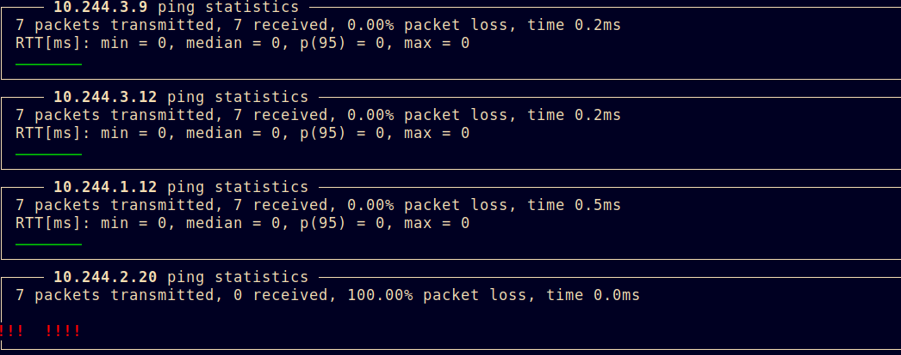

## container-diagnostic-tools


Endoscope: snoop around inside your Kubernetes pods.

- Debug them
- Ping from them to others
- Wireshark from them
- tcpdump
- and more

## Usage

This repo contains two components:

1. A Python script (scope) which will launch a utility container
   into the namespace of a running pod, and then perform commands
   such as ping other pods or debug or capture within it.
2. A utility container (utilities/endoscope) which is a Ubuntu 18.04
   image with gdb/tcpdump/dumpcap/ping/hping/curl installed in it.

Overal usage. This requires a source namespace/pod to attadch to.
By default it launches a single new container, leaving it running
for better interactive performance. To terminate at the end
of each command, use '--terminate'. To cleanup all, use the 'cleanup'
command.

By default this assumes the utility container comes from a private
registry, and that registry credentials named 'regcred' exist. If
not, use '--regcred ""' to override.

```
kubectl create secret -n NAMESPACE docker-registry regcred --docker-server=SERVER --docker-username="USER" --docker-password="PASS"
```

Use scope --help for up-to-date arguments. Current global arguments:

```
  -h, --help            show this help message and exit
  -i IMAGE, --image IMAGE
                        Image to scope with
  -n NAMESPACE, --namespace NAMESPACE
                        Source namespace
  -p POD, --pod POD     Source pod
  -c REGCRED, --regcred REGCRED
                        Registry credentials, if private
  -t, --terminate       Terminate (do not cache) debug pod (e.g. terminate
                        each time)
```

### Ping

This will ping either a single, or all, pods in a given namespace,
from another pod/namespace combination. The output can be graphical
(-g) or not.

```
  -h, --help            show this help message and exit
  -d DEST_POD, --dest-pod DEST_POD
                        Destination pod
  -N DEST_NAMESPACE, --dest-namespace DEST_NAMESPACE
                        Destination pod namespace
  -c COUNT, --count COUNT
                        Count of pings to send
  -i INTERVAL, --interval INTERVAL
                        Interval of pings to send
  -g, --graph           Graph result
  -a, --all             Ping all in namespace
```

Ping all pods in a namespace, from a given one, in graphical form:
`scope -n NAMESPACE -p SRC-POD ping -c0 -a -g`


### Hping

hping3 a pod in a namespace, from a given one. This allows
TCP, UDP as options instead of just ICMP.

`scope -n NAMESPACE -shop -p POD hping -N DESTNAMESPACE -d DESTPOD  -- -c 1`

After the --, all arguments are passed to hping3. See hping3(8)

### Shell

Obtain a shell in the network namespace of a given pod:
`scope -n NAMESPACE -p SRC-POD shell`

Run 'ip address' command in the network namespace of a given pod:
`scope -n NAMESPACE -p SRC-POD shell ip address`

### Launch

Launch a debug pod and leave it running, with access to the PID/network
namespace of a given pod:
`scope -n NAMESPACE -p SRC-POD launch`

### Cleanup

Cleanup a/all the debug-* pods in a namespace.

`scope -n NAMESPACE -p all cleanup` -- remove all the debug-*
`scope -n NAMESPACE -p POD cleanup` -- remove the debug-POD

The above commands, unless run with '-t' for terminate, leave the
debug- pod around after starting (for better interactive performance).

### Pids

Obtain the list of pids (in host coordinate terms) for the given
container. This is useful to e.g. attach gdb or strace:

`scope -n NAMESPACE -p POD pids`

### Strace

strace a pid (default first pid in Pod).

`scope -n NAMESPACE -p POD strace [-p #] [-e expr]`

If 'expr' is specified, show only those syscalls (see strace(1)).
If -p # is specified (e.g. as the result of the 'pids' command), use
this pid instead of the first.

### gdb

Debug (gdb) a pid (default first pid in Pod).

`scope -n NAMESPACE -p POD gdb [-p #]`

Runs the debugger, privileged, in the pid namespace, attached.

## Container

The container here (agilicus/endoscope) contains tools to

 - cross ping / tcp / udp connectivity check
 - capture traffic
 - inject traffic
 - debug processes

This is normally run as a privileged container on the
node, mounting the network namespaces. It can then,
given another Pod name, 'enter' it. It works in conjuncton
with the python script 'scope'.

The motivation is to run this under Kubernetes as:

```
---
apiVersion: v1
kind: Pod
metadata:
  name: debug
spec:
  nodeName: XXXX
  hostPID: true
  imagePullSecrets:
    - name: regcred
  containers:
  - name: debug
    securityContext:
      privileged: true
    image: agilicus/endoscope:latest
    volumeMounts:
    - mountPath: /var/run/cri.sock
      name: crisock
    - mountPath: /run/docker/netns
      name: netns
  volumes:
  - hostPath:
      path: /var/run/dockershim.sock
      type: ""
    name: crisock
  - hostPath:
      path: /var/run/docker/netns
      type: ""
    name: netns
```

and thus attach to a Pod in XXXX w/ 'nsenter -n -t <PID>'.

## Use within istio and outbound (egress) firewall

If you are attaching this tool to a pod which is managed by an istio
sidecar, you may find that outbound network access is blocked. If this
is a problem you can run:

```
iptables -t NAT -D OUTPUT -p tcp -j ISTIO_OUTPUT
```

as a temporary means of enabling output access.

## Filesystem access
To find which overlay mount is the guest filesystem (e.g. to find a file),
on the guest run 'ls -i <file>', which gives you the inode. Then, in
endoscope, run debugfs:

On debugee:
```
bash-4.4$ ls -i usr/local/lib/python3.7/http/client.py
3601465 usr/local/lib/python3.7/http/client.py
```

On endoscope:
```
# df -lh /var/lib/docker/overlay2/
Filesystem      Size  Used Avail Use% Mounted on
/dev/sda1        30G   22G  7.2G  76% /var/lib/docker
root@debug-dashboard-superset-d4cd75b78-mswbl:/var/lib# debugfs -R 'ncheck 3601465' /dev/sda1 2>/dev/null
Inode	Pathname
3601465	/var/lib/docker/overlay2/c509876fb71d801e4398f7c11cc9d4458dc30f6f6334301d3e51704037cadd68/diff/usr/local/lib/python3.7/http/client.py
```

## License

The container is released under Apache 2.0 license.
The individuals files within it vary.
